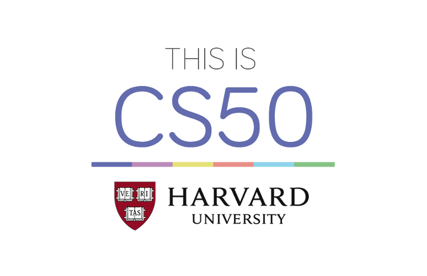

### Course description
This is CS50x, Harvard University's introduction to the intellectual enterprises of computer science and the art of programming for majors and non-majors alike, with or without prior programming experience. 

An entry-level course taught by David J. Malan, CS50x teaches students how to think algorithmically and solve problems efficiently. Topics include abstraction, algorithms, data structures, encapsulation, resource management, security, software engineering, and web development. Languages include C, PHP, and JavaScript plus SQL, CSS, and HTML. Problem sets inspired by real-world domains of biology, cryptography, finance, forensics, and gaming.

### What you'll learn
* A broad and robust understanding of computer science and programming
* How to think algorithmically and solve programming problems efficiently
* Concepts like abstraction, algorithms, data structures, encapsulation, resource management, security, software engineering, and web development
* Familiarity in a number of languages, including C, PHP, and JavaScript plus SQL, CSS, and HTML
* How to engage with a vibrant community of like-minded learners from all levels of experience
* How to develop and present a final programming project to your peers

## Problem Sets

A summary of problem sets appears below

|Problem Set|	|Language|
|:----------------------|:-----:|:-------------:|
|[Problem Set 0][pset0] |Scratch|Scratch|
|[Problem Set 1][pset1] |C|C|
|[Problem Set 2][pset2] |Crypto|C|
|[Problem Set 3][pset3] |Game of Fifteen|C|
|[Problem Set 4][pset4] |Forensics|C|
|[Problem Set 5][pset5] |Mispellings|C|
|[Problem Set 6][pset6] |Sentimental|Python|
|[Problem Set 7][pset7] |C$50 Finance|Python, SQL|
|[Problem Set 8][pset8] |Mashup|JavaScript|
|[Final Project][final] |Any|Any|

[pset0]: pset0/

[pset1]: pset1/

[pset2]: pset2/

[pset3]: pset3/

[pset4]: pset4/

[pset5]: pset5/

[pset6]: pset6/

[pset7]: pset7/

[pset8]: pset8/

[final]: final_project/

[0]: https://courses.edx.org/courses/course-v1:HarvardX+CS50+X/courseware/d0c88865e9434f17808f54870ea230a1/5b52cf0573bb4c9ab8bc979e728b2446/

[1]: https://courses.edx.org/courses/course-v1:HarvardX+CS50+X/courseware/d0c88865e9434f17808f54870ea230a1/da6b01d04a5643e796a4ec904db9363c/

[2]: https://courses.edx.org/courses/course-v1:HarvardX+CS50+X/courseware/d0c88865e9434f17808f54870ea230a1/e7180a2d0f4445878d0e74f6ddbde944/

[3]: https://courses.edx.org/courses/course-v1:HarvardX+CS50+X/courseware/d0c88865e9434f17808f54870ea230a1/423d8aa02ac945acb41fdb3fa5e8af88/

[4]: https://courses.edx.org/courses/course-v1:HarvardX+CS50+X/courseware/d0c88865e9434f17808f54870ea230a1/04d14ed5bcaf4d7fae80b6e0772fd1c7/

[5]: https://courses.edx.org/courses/course-v1:HarvardX+CS50+X/courseware/d0c88865e9434f17808f54870ea230a1/9096126aaf144aab9fa4aeb8ad9eb938/

[6]: https://courses.edx.org/courses/course-v1:HarvardX+CS50+X/courseware/d0c88865e9434f17808f54870ea230a1/3bc1fc6f3ec949eebc726673d164fff8/

[7]: https://courses.edx.org/courses/course-v1:HarvardX+CS50+X/courseware/d0c88865e9434f17808f54870ea230a1/9bd6a0559c6d4a6d923a94375347efc0/

[8]: https://courses.edx.org/courses/course-v1:HarvardX+CS50+X/courseware/d0c88865e9434f17808f54870ea230a1/5f245ed1b5004cdcb2f37a09ea90f05d/

[9]: https://courses.edx.org/courses/course-v1:HarvardX+CS50+X/courseware/d0c88865e9434f17808f54870ea230a1/59d12907a77f4f4d8d24b831003b6962/

[10]: https://courses.edx.org/courses/course-v1:HarvardX+CS50+X/courseware/d0c88865e9434f17808f54870ea230a1/6f7f4b3b4f89444ea4f32563569fe093/

[11]: https://courses.edx.org/courses/course-v1:HarvardX+CS50+X/courseware/d0c88865e9434f17808f54870ea230a1/51ce7ee1ff8b46019f32c6cc729f307b/

